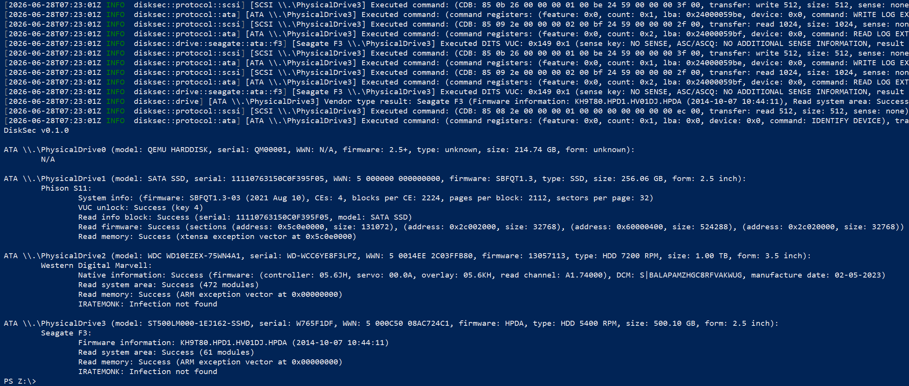

# DiskSec: Storage Drive Firmware Security Assessment

DiskSec is a tool for assessing the firmware security of storage drives. It tests
accessibility of undocumented manufacturer features, called Vendor Unique Commands
(VUCs), that provide low-level access to drive internals such as reprogramming firmware, accessing
hidden storage in the drive System Area (SA), and direct access to controller RAM.

## Supported drives

Vendor          | Architecture         | Command Set | Type | Manufactured
--------------- | ---------------------| ------------|----- |----------------
Phison          | S5, S8, S9, S10, S11 | ATA         | SSD  | 2010 to present
Seagate         | F3                   | ATA         | HDD  | 2007 to present
Western Digital | Marvell              | ATA         | HDD  | 2006 to present

## Requirements

DiskSec must be executed on Windows or Linux with administrator or root equivalent privileges. Checks performed only use read access to features with nothing written or modified, as such it should be safe to execute without risk of damage or other side effects, however as with any tool accessing low-level undocumented hardware features usage is at your own risk.

Ideally drives should be tested attached directly to a hardware SATA controller, however USB-SATA adapters are technically compatible and should work in most cases, some USB-SATA bridge chipsets may have compatibility issues transporting VUCs used by some drive types.

## Usage

List available drives:

```
disksec list
```

Run checks on single drive:

```
disksec run <PATH>
```

Run checks on all drives:

```
disksec run
```

Run checks on all drives with verbose logging, and write results to file:

```
disksec run -vv -o output.txt
```

Example output:

